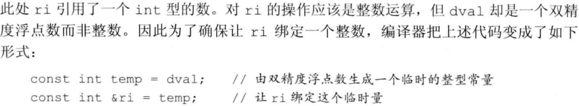

<center>基础不牢, 地动山摇</center>

# 标准库

## iostream

> istream + ostream

- cin
- cout
- cerr: 输出警告和错误信息
- clog: 输出程序运行时的一般性信息
- <<: 输出运算符
  - 接收两个运算对象: 左侧一个ostream对象, 右侧一个要打印值. 
  - 作用: 将要打印的值写到ostream对象中, 然后输出那个ostream对象
  - `std::cout<<a<<b;` 这两个输出运算符的左侧运算对象是同一个
- \>>: 输入运算符
  - 接收两个运算对象: 左侧一个istream对象, 右侧一个运算对象. 
  - 作用: 从给定的istream读入数据, 并存入指定对象中. 返回其左侧运算对象, 如std::cin. 
- endl: 操纵符(manipulator) 结束当前行, <u>并将与设备关联的缓冲区(buffer)中的内容刷到设备中</u>. 
  - 缓冲刷新操作可以保证: 到目前为止程序所产生的所有输出都真正写入输出流中, 而不是停留在内存中等待写入流. 

# 基本类型

- 分为 算术类型(arithmetic type) 和 空类型(void)
  - 算术类型: 字符, 整型数, 布尔值, 浮点数
  - 空类型: 不对应具体的值

## short

> 短整型 16位

## int

> 整型 16位

- unsigned int, 缩写 unsigned

## long

> 长整型 32位

## long long

> 长整型 64位
>
> C++11

## char

- 分为 char, signed char, unsigned char. <u>由于字符的表现形式只有两种, 因此编译器会决定char表现为另外两种形式中的一种(不同编译器可能会不一样).</u> 

## double

- 浮点数运算使用double. 因为float精度不够, 且速度不一定快. 而long double运行损耗又不容忽视. 

## 字面值常量

> literal
>
> eg. 一个数字等

- 每个字面值常量都对应一种数据类型, 字面值常量的形式和值决定了它的数据类型

### 类型

- 整型字面值

  - eg. 数值20: 十进制20, 八进制024, 十六进制0x14
  - 默认十进制字面值是带符号数, 八, 十六不确定
  - 十进制字面值的类型是能容纳当前值的int, long, long long中最小尺寸那个. 尽管整型字面值可以存储在带符号数据类型中, 但<u>严格说十进制字面值不会是负数</u>. 一个形如负数的十进制字面值, 它的负号是不在字面值之内的, 负号的作用是对字面值取负值而已. 
  - 八, 十六进制是在int, unsigned int, long, unsigned long, long long, unsigned long long中选尺寸最小的那个

- 浮点型字面值是一个double

- 字符字面值是一个char

- 字符串字面值是由常量字符构成的数组

  ```cpp
  std::cout<<"a long
  		  "long literal"<<std::endl
  ```

  虽然分两行, 但这是一个字符串字面值

- 转义序列

  - 如\n, \t

  - 泛化的转义序列: 形式是\x后紧跟1个或多个十六进制数字, 或者\后面跟1个, 2个或<u>3</u>个<u>八进制</u>数字. ([1], p36)

    

- 指定字面值类型

  

  

  - 1024f必须写成1024.f

- 布尔字面值: true, false

- 指针字面值: nullptr

## (un)signed

- 如果表达式中既有带符号类型又有无符号类型, 那么带符号数会自动转换为无符号数. (如果这个带符号数是负的, 那结果

## 类型转换

([1], p32)

# 复合类型

> compound type
>
> 基于其他类型定义的类型

## 引用

- 为对象起另一个名字, 即别名

:exclamation: 引用必须被初始化

### 引用的定义

```cpp
int i = 1024, &r = i;
int &refVal = 10;  // ERROR, 字面值非对象
```

- 因为引用本身不是一个对象, 因此不能定义引用的引用
- 引用只能绑定在对象上

:exclamation: 定义引用时程序把引用和它的初始值绑定(bind)在一起, 一旦绑定无法更改

- 引用的类型要和与之绑定的对象严格匹配, 除了常量引用

  为什么这样就不行呢, 为什么一定要类型匹配呢? 

  ```cpp
  double dval = 3.14;
  int &ri = dval;  // ri = 3
  ```

  - 因为需要类型转换的话需要一个临时量, 先把double值赋给一个临时量, ri和临时量做绑定, 注意不是和dval做绑定, 所以引用也就没意义了, 因为引用就是要能够通过ri去改变dval的值, 而现在ri绑成了其他一个量, 所以C++干脆把这种行为归为非法. 而如果加了const就可以, 可能是因为

    

### 左值引用

> lvalue reference
>
> 通常说引用说的是左值引用

### 右值引用

> rvalue reference

### 指向指针的引用

- 没有指向引用的指针(引用非对象), 但有指向指针的引用

```cpp
int i = 42;
int *p;
int *&r = p;  // 指向指针p的引用r, *和&顺序不能反, 因为&离变量名近, 所以r首先是一个引用

r = &i;  // r, p指向i
*r = 0;  // i=0
```

### reference to const

> 经常被叫做 常量引用, 但是叫做<u>对常量的引用</u>, "指向"常量的引用更准确一些 (把引用绑定到const对象上, 类似指针中的指向常量的指针) 
>
> 因为常量引用应该是翻译为const reference的, 而不存在const reference(int i = 1; int &const r = i; ), 因为引用不是一个对象, 没法让引用本身恒定不变, 但是有const pointer(int i = 1; int *const r = &i; ). 

- 可以把引用绑定到常量上, 但是对常量的引用不能被用作修改它所绑定的对象
- 引用的对象是常量还是非常量可以决定其所能参与的操作(const int &r=1024, r不能重新赋值r=100), 但是不会影响到引用和对象的绑定关系本身(int i=1024; const int&r1 = i; i依然可以改变)

#### 初始化

- <u>初始化常量引用的时候允许用任意表达式作为初始值</u>, 只要该表达式的结果能够转换成引用的类型即可. 允许为一个常量引用绑定<u>非常量的对象, 字面值, 一般表达式</u>. 

```cpp
int i = 1024;
const int &r1 = i;  // 如果i改变, r1也会变, 但是不允许通过r1修改i的值
const int &r2 = 2048 - 1024;
const int &r3 = r1 * 2;

double dval = 3.14;
const int &ri = dval;  // ri = 3
// &ri != &dval; 二者的地址是不同的
```



常量引用可以自动类型转换, 可以绑定字面值, 一般表达式, 应该是中间都有产生一个未命名的**临时量(temporary)**对象. 

编译器使用一个临时量来做周转，ri绑定的是临时量对象，它是一个常量。

那么编译器为什么要大费周折的做这件事情呢？因为它有很大的好处！


## 指针

- 指向另一种类型的复合类型

### 与引用的比较

- 都是实现了对其他对象的间接访问
- 指针本身就是一个对象, 允许对指针赋值和拷贝
- 指针可以先后指向不同对象, 引用的指向是不变的. 所以有pointer to const(指向常量的指针), const pointer(指针本身是常量), 但是只有reference to const(和常量绑定的引用), 没有const reference(引用不是对象, 更无所谓常量). 
- 指针可以为空, 引用不可以, 一定要赋初值

### 初始化

- 引用没有实际地址(非对象), 指针不能指向引用
- 指针的类型要和它所指向的对象严格匹配, 除了pointer to const可以指向一个非常量对象, 以及...

:fist_right: 指针要初始化, 为 nullptr 或其他, 因为 nullptr 可以转换为任意其他的指针类

### 解引用符

```cpp
int ival = 42;
int *p = &ival;
cout<<*p;
```

### 空指针

生成方法

```cpp
int *p1 = nullptr;  // best
int *p2 = 0;
int *p3 = NULL;  // #include cstdlib
```

### 指针值

- 指向一个对象
- 指向紧邻对象所占空间的下一个位置:question:
  - 一个指针指向某个对象, 同时另一个指针指向另外对象的下一个地址, 此时有可能两个指针值相同
- 空指针(没有指向任何对象)
- 无效指针(不是上述的任何情况)

### void*

> 一种特殊的指针类型, 可以存放任意对象的地址

```cpp
double obj = 3.14, *pd = &obj;

void *pv;
pv = &obj;  // 指向double
pv = pd;    // 指向double指针
```

- 可以做的: 和别的指针比较, 作为函数的输入输出, 给另一个void*指针赋值
- 不能做的: 不能直接操作void*指针所指的对象(因为不知道这个对象的类型)

### 指向指针的指针

### pointer to const

> 指向常量的指针
>
> 不能用于改变其所指对象的值

- 类似常量引用, 指向常量的指针不能用于改变其所指向的对象的值. 那它的作用是什么呢? <u>作用就是存放常量对象的地址</u>
- 不初始化不会报错

```cpp
const double pi = 3.14;
const double *cptr = &pi;

double dval = 10;
cptr = &dval;
```

- <u>指向常量的指针可以指向一个非常量对象</u>, 被指向的对象可以通过其他方式改变, 但是不能通过指向常量的指针改变. 听起来有点是指针"自以为是", 以为自己指向的是常量, 也就自觉地不去改变所指对象的值了. 

# 变量

## 变量定义

> 变量定义就是告诉编译器在何处创建变量的存储，以及如何创建变量的存储

- 变量的定义包括一个**基本数据类型(base type)**和一组**声明符**(声明符可以包括类型修饰符 *或&)

  ```cpp
  int i = 1024, *p = &i, &r = i;  // (1)
  int * p1, p2;  // (2)
  ```

  - 如上(1), 虽然基本类型只有一个, 但是声明符的形式可以不同, 也就是一条定义语句可能定义出不同类型的变量
  - 如上(2), 定义的是一个指针和一个int, *是声明符的一部分, 它只是修饰了p1, 对该声明语句中的其他变量没有影响. 

### 初始化

- **初始化不是赋值**, 初始化的含义是创建变量时赋予其一个初始值, 而赋值的含义是把对象的当前值擦除, 然后以一个新值替代. 

#### 列表初始化

> list initialization

- 初始化或者是为对象赋新值都可以使用这样一组由花括号括起来的初始值. 

```cpp
int a = {0};  // 注意是int哦
int b{0};
```

- 重要特点: <u>如果使用列表初始化且初始值存在丢失信息的风险, 则编译器会报错</u>(或warning):

  ```cpp
  long double ld = 3.1415926536;
  int a{ld};  // warning
  int b = {ld};  // warning
  int c(ld);
  int d = ld;
  ```

#### 默认初始化

> default initialization

- 变量被赋予默认值, 默认值是什么由变量类型和(某些情况下)变量的位置决定
  - 如果内置类型的变量未被显式初始化, 它的值由定义的位置决定: 定义于任何函数体之外的变量被初始化为1; <u>定义在函数体内部的内置类型将**不被初始化**(uninitialized).</u> 

#### 显式初始化

### 与声明的关系

> definition & declaration

- 为了支持分离式编译(separate compilation, 允许将程序分为若干个文件, 每个文件可被单独编译), 同时文件之间又需要共享代码(一个文件可能用到另一个文件的变量), C++将声明和定义区分开来.
  - 声明: 使名字为程序所知, 定义变量的类型和名字
  - 定义: 负责创建与名字关联的实体 定义变量的类型和名字, 申请存储空间, 可能还有为变量赋初始值

```cpp
extern int i;      // 声明i, 但不定义i
int j;         	   // 声明并定义j
extern int k = 3;  // 声明并定义k, 赋初值抵消了extern的作用
```

- :exclamation: 如果在函数体内部试图初始化一个由extern关键字标记的变量, 将引发错误

- <u>变量能且只能被定义一次, 但可以被多次声明</u> 
- 如果在多个文件中使用同一个变量, 就必须将声明和定义分离: <u>变量的定义必须且只能出现在一个文件中, 而其他用到该变量的文件必须对其进行声明, 却绝对不能重复定义</u>

## 变量声明

- 一条声明语句有一个**基本数据类型 (base type)**和紧随其后的一个**声明符 (declarator)**列表组成
  - 每个声明符命名了一个变量, 并指定该变量为与基本数据类型有关的某种类型
  - 声明符可以是变量名, 此时变量的类型也就是声明的基本数据类型
  - 还有更复杂的声明符

## 标识符

> identifier

- 定义在函数体外的标识符不能以下划线开头

:fist_right: 变量名一般用小写字母, 用户自定义的类名一般以大写字母开头

## 作用域

### 全局作用域

> global scope

### 块作用域

> block scope

### 内层作用域

> inner scope

### 外层作用域

> outer scope

# 常量

## const

> const 限定符

- const对象一旦创建后其值就不能修改, 所以<u>const对象必须初始化</u>

- 默认情况下, const对象仅在文件内有效: <u>编译器在编译的过程中会把用到const变量的地方用const变量的值来替换</u>. 如果程序包含多个文件, 由于每个用了const对象的文件都要能访问到它的初始值才行, 就免不了要再定义一次. 为了避免重复定义, 默认情况下const对象被设定为仅在文件内有效. 当多个文件中出现了同名的const变量时, 其实是分别定义了独立的变量

- <u>要想const变量在文件间共享, 不让编译器为每个文件分别生成独立的变量, 需要在声明和定义这个const变量的时候添加extern关键字</u> ([1], p54)

  

## const pointer

- 指针是对象, 所以像其他对象类型一样, 可以把指针自身定位常量(引用就不行)
- const pointer必须初始化, 一旦初始化后, 它的值(存放的地址)就不能再改变了. 
- <u>不能改变的是指针自身的值而非指向的那个值</u>, 可以通过指针修改指向的那个值

```cpp
int errNumb = 0;
int *const curErr = &errNumb;  // curErr不能再指向其他

const double pi = 3.14;
const double *const pip = &pi;  // 指向常量对象的const pointer, 不能修改指向的对象, 也不能通过pip修改指向对象的值
```

从右向左读: 

- const: 离curErr最近的是const, 所以它首先是一个常量
- *: 对象的类型由声明符的其余部分确定. 下一个符号是\*, 所以curErr是一个常量指针
- int: 指向int的常量指针

## x-level const

> 顶层 const: top-level const, 本身是常量
>
> 底层 const: low-level const, 指向的对象是常量

- 顶层 const可以表示任意的对象是常量, 算数类型, 类, 指针等
- 底层 const则与指针和引用等符号和类型的基本类型部分有关
- 指针类型既可以是顶层const, 也可以是底层const
- 对于函数而言，还有一个 `return_type class::funcname(param_list) const`，这个 const 虽然看起来在右边，但其实是用来修饰 *this 的，应该理解为 const typeof(this) *this，也是 low level const。

# ghost

> 尚没在框架中找到合适位置的ghost

- Windows的可执行文件是 .exe, UNIX系统通常是 .out, 或者没有后缀
- C++是一种静态数据类型(<u>静态类型</u>, statically typed)语言, 它的类型检查发生在编译时(检查类型的过程称为类型检查type checking): 编译器会检查数据类型是否支持要执行的运算, 如果支持, 编译器会报错且不会生成可执行文件. 

# Reference

- [1] C++ Primer 5th

# FYI

- :exclamation:: 注意, 容易出错的地方
- :question:: 尚无法理解
- :bulb:: 被妙到的地方
- :fist_right:: best practice
- <u>UNDERLINE</u>: 之前没有注意过的内容